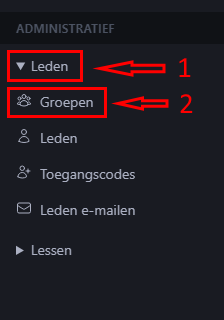
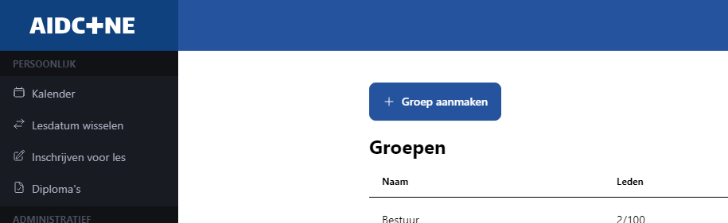
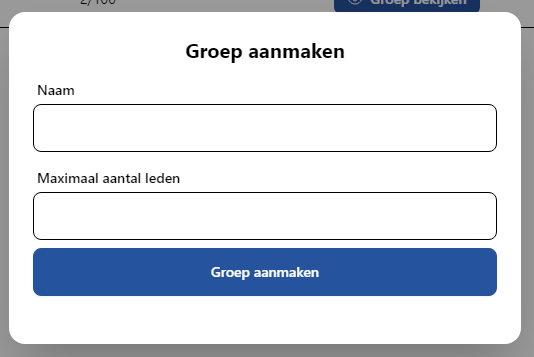
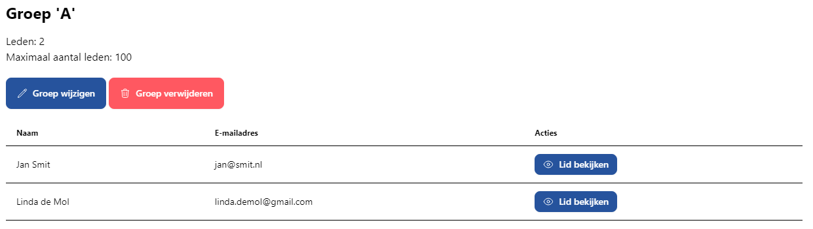
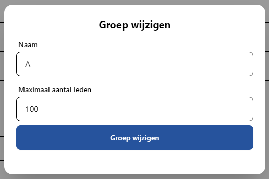
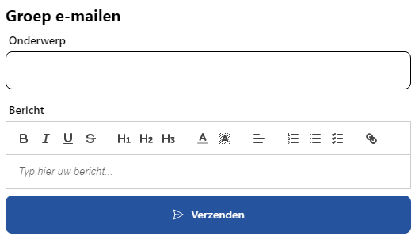

# Groepen

Groepen kunnen voor verschillende doeleinden gebruikt worden afhankelijk van hoe u de applicatie wilt gebruiken. Groepen kennen verschillende functionaliteiten: u kunt in één keer een hele groep e-mailen en u kunt groepen toewijzen aan lessen. Voor een goed overzicht raden we aan aparte groepen te maken per rol en voor mensen die gelijktijdig een les volgen.

De lijst met groepen vindt u onder het kopje **Leden** van het administratieve gedeelte. Open dit kopje door op de pijl of het woord "Leden" te klikken.

## Groep aanmaken

Op de pagina met de lijst met groepen vindt u ook de knop **Groep aanmaken**.

Wanneer u hierop klikt opent zich een menu. Voer hier een naam en het maximaal aantal leden in. Deze zijn later te wijzigen.

## Groep aanpassen of verwijderen

Na het aanmaken van een groep komt deze in de tabel op de pagina via waar u ook groepen aanmaakt. Via de knop **Groep bekijken** opent u de pagina van de groep. Hier vindt u informatie over de groep (naam, aantal leden, maximaal aantal leden, ledenlijst) en twee knoppen.

U kunt de naam en het maximaal aantal leden wijzigen via **Groep wijzigen**. Hiervoor opent zich een menu.

Via de knop **Groep verwijderen** kunt u de groep verwijderen. Er wordt eerst om een bevestiging gevraagd.

:::info

U kunt geen groep verwijderen die leden bevat. Zet elk lid individueel om naar een andere groep, om daarna te groep te kunnen verwijderen.

:::

## Groep e-mailen

Op dezelfde pagina waar u informatie over de groep vindt en de groep kunt wijzigen, vindt u een formulier om een e-mail naar alle leden in die groep te sturen.

Zie voor een algemene uitleg over e-mailen via AidCone [deze pagina](/bestuur/emailen).

