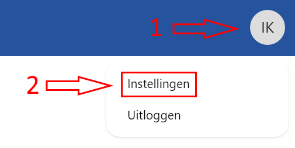
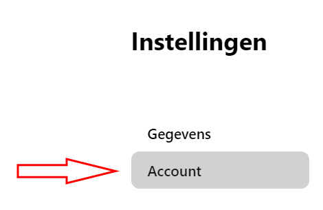
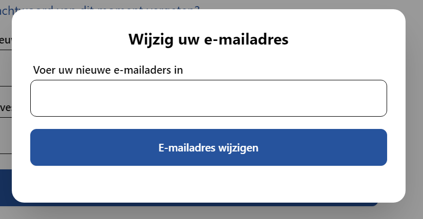

# Account beheren

## Gegevens wijzigen

Wanneer uw persoons- of adresgegevens wijzigen is het belangrijk uw EHBO vereniging hiervan op de hoogte te stellen. Dit kan via AidCone.

Klik hiervoor op uw initialen rechtsboven in het scherm. Er opent zich een menu, kies daar **Instellingen**.

U komt nu automatisch in het **Gegevens** deel van de instellingen. Dat ziet u links op het scherm.

Hier kunt u uw gegevens zoals ze nu in het systeem staan inzien en deze bijwerken.

Vergeet niet uw wijzigingen op te slaan door op de blauwe knop met de tekst **Gegevens bijwerken** te klikken.

## E-mailadres wijzigen

In de instellingen kunt u ook naar het deel **Account**. U komt hier via het menu aan de linkerkant van het scherm.

Onderaan deze pagina vindt u een knop **E-mailadres wijzigen**. Wanneer u hierop klikt opent zich een menu.

Voer hier uw nieuwe e-mailadres in en klik op **E-mailadres wijzigen**. U ontvangt nu op uw nieuwe e-mailadres een bericht om deze actie te bevestigen.

Klik in dit e-mailbericht op het zwarte blok met daarin de tekst **E-mailwissel bevestigen**. Hierna kunt u opnieuw inloggen met uw nieuwe e-mailadres, maar uw oude wachtwoord.

## Wachtwoord wijzigen

Wanneer uw wachtwoord per ongeluk openbaar wordt of u vermoedt dat u gehackt bent, is het belangrijk uw wachtwoord te wijzigen.

Ga hiervoor naar het deel **Account** in de instellingen zoals bij het wijzigen van uw e-mailadres. U vindt hier het formulier om uw wachtwoord te wijzigen.

Voer uw huidige wachtwoord in bij het veld *Wachtwoord van dit moment*. Indien u dit vergeten bent, klikt u op **Wachtwoord van dit moment vergeten?** of volgt u de handleiding [Wachtwoord vergeten](/leden/registreren-inloggen-uitloggen#wachtwoord-vergeten).

Voer hierna uw nieuwe wachtwoord in. U moet deze 2x invoeren om te voorkomen dat u typfouten maakt.