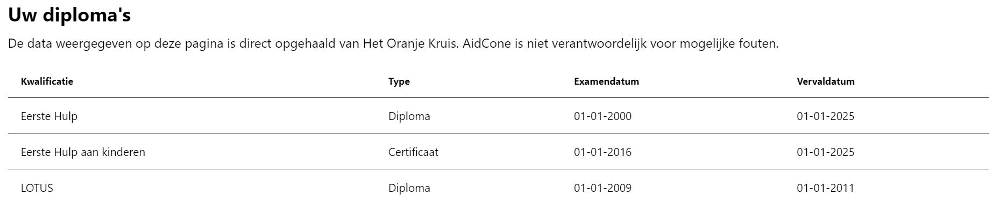

# Diploma's bekijken

Als u uw Het Oranje Kruis diploma nummer en achternaam juist heeft ingevuld bij uw persoonsgegevens, kan AidCone informatie over uw diploma's en certificaten weergeven.

:::tip

Diploma nummer en/of achternaam niet juist ingevuld? Ga naar de handleiding [Gegevens bijwerken](/leden/account-beheren#gegevens-wijzigen).

:::

Klik hiervoor op **Diploma's** in de navigatiebalk. Op een mobiel of kleine tablet zit deze achter het hamburgermenu (☰).

Hier vindt u een tabel met uw diploma's en certificaten, met daarbij de kwalificatie, het type (diploma/certificaat), de examendatum en de vervaldatum.

:::warning

Deze tabel kan vervallen diploma's bevatten.

De data is direct opgehaald van Het Oranje Kruis. AidCone is niet verantwoordelijk voor mogelijke fouten.

:::