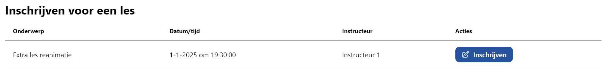
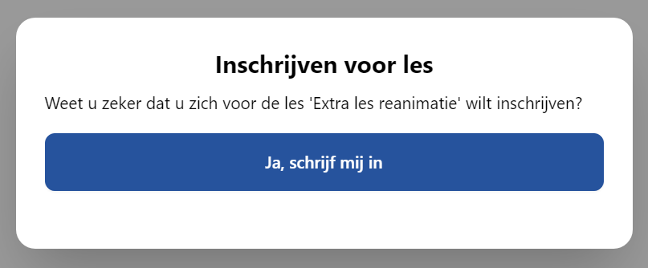

# Inschrijven voor een les

Klik hiervoor op **Inschrijven voor les** in de navigatiebalk. Op een mobiel of kleine tablet zit deze achter het hamburgermenu (☰).

Op deze pagina vindt u een tabel met de lessen met vrije inschrijving die uw vereniging heeft aangemaakt.

Om in te schrijven, klikt u op **Inschrijven**. Er opent zich nu een menu waar u uw inschrijving kunt bevestigen. Klik hier op **Ja, schrijf mij in**.

Lessen waarvoor u bent ingeschreven verschijnen automatisch in uw kalender.

:::warning

U kunt zich niet zelf afmelden voor een les met vrije inschrijving. Neem hiervoor contact op met uw vereniging.

:::