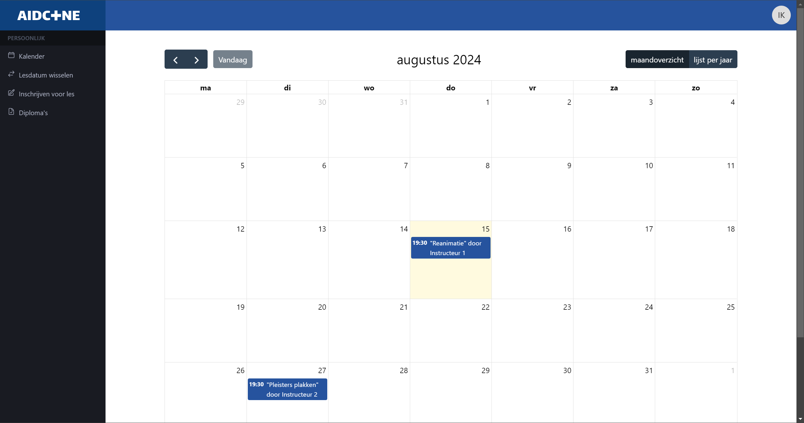
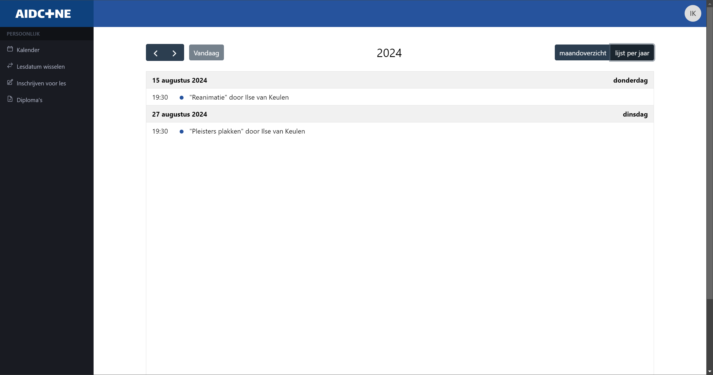

# Kalender

De voor u relevante activiteiten van uw EHBO vereniging (herhalingslessen van uw groep, lessen waarvoor u bent ingeschreven, etc.) zijn voor u zichtbaar in een kalender.

Klik hiervoor op **Kalender** in de navigatiebalk. Op een mobiel of kleine tablet zit deze achter het hamburgermenu (☰). De kalender is tevens de homepagina van de applicatie wanneer u inlogt.

Standaard gebruikt u de maandweergave. Met de pijltjes linksboven wisselt u van maand. Via **Vandaag** komt de kalender terug bij de huidige maand. Vandaag is in de kalender aangegeven met een lichtgele markering van de hele dag.

Met de knop **Lijst per jaar** rechtsboven kunt u wisselen van de maandweergave naar een lijst met alle voor u relevantie activiteiten van een jaar in één lange lijst, gesorteerd op datum. Ook hier kunt u de pijltjes gebruiken om door de verschillende jaren te bladeren.

:::warning

Deze lijst toont activiteiten per kalenderjaar en niet per seizoen van uw vereniging.

:::

