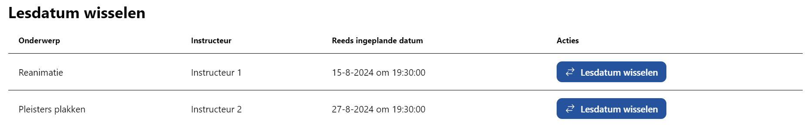
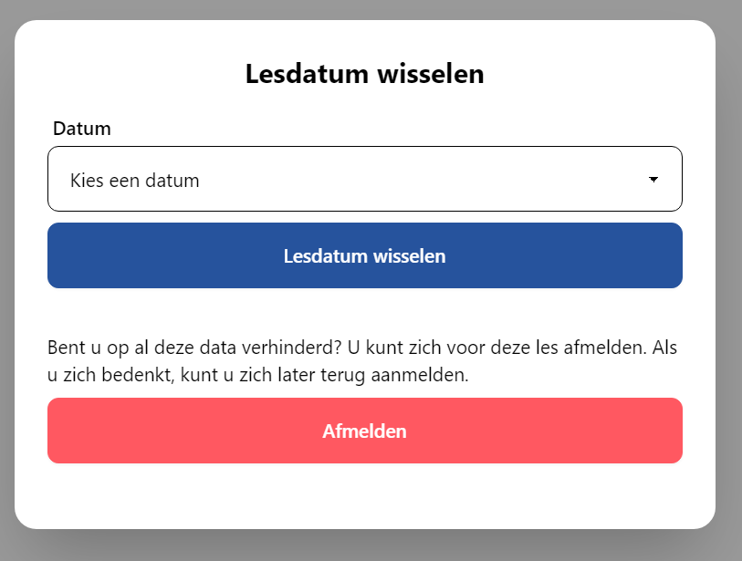
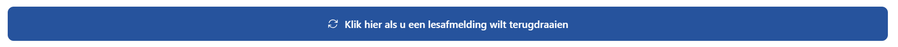
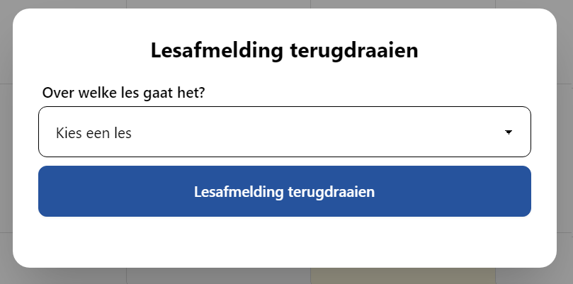

# Lesdatum wisselen of afmelden

Wanneer u verhinderd bent voor een les, zou het kunnen dat er op een andere datum nog plaats voor u is. AidCone houdt dit automatisch voor uw vereniging bij.

Klik hiervoor op **Lesdatum wisselen** in de navigatiebalk. Op een mobiel of kleine tablet zit deze achter het hamburgermenu (☰).

Op deze pagina vindt u een tabel met al uw lessen, de instructeur en de datum waarvoor u door uw vereniging bent ingeschreven.

Wanneer u klikt op **Lesdatum wisselen** opent zich een menu.

Klik op **Kies een datum** om een menu te openen met alle beschikbare alternatieve data. Selecteer hier een andere datum en klik daarna op **Lesdatum wisselen**.

:::info

In dit menu ziet u alleen de lesdata waar nog plaatsen beschikbaar zijn. Voor elke les wordt een maximum aantal deelnemers vastgesteld. Als deze bereikt is (standaard groep + aanmeldingen – afmeldingen) kunt u zich niet meer voor deze datum inschrijven. Het kan voorkomen dat er later wel plaatsen beschikbaar zijn.

:::

Het is ook mogelijk u voor een les af te melden. Dit kan gevolgen hebben voor uw diploma, informeer bij twijfel bij uw vereniging.

Wanneer u voor een les afgemeld bent, verschijnt op de kalender pagina een knop om lesafmeldingen terug te draaien.

Wanneer u hierop klikt opent zich een menu. Selecteer hier de les waarbij u toch aanwezig kunt zijn en klik op **Lesafmelding terugdraaien**.

Updates in uw planning door een leswissel of afmelding ziet u meteen in uw kalender terug.