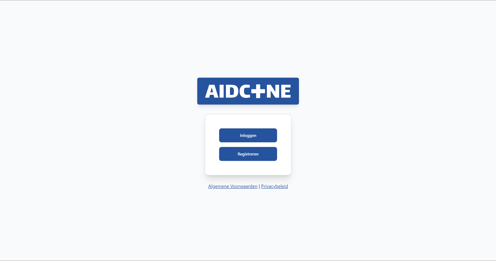
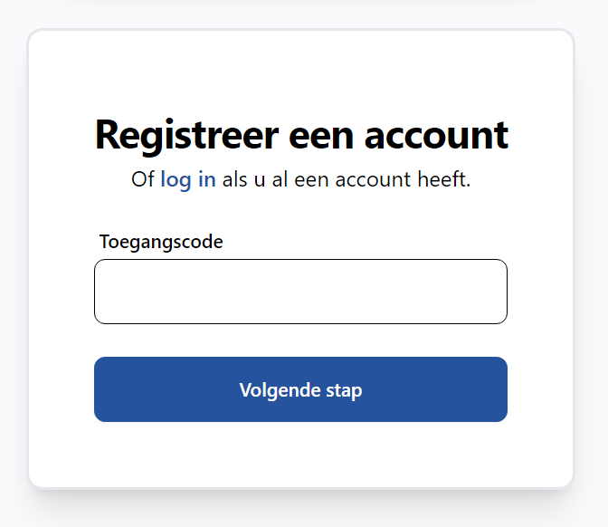
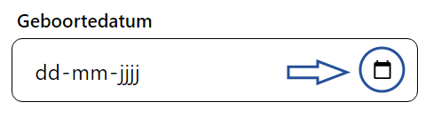
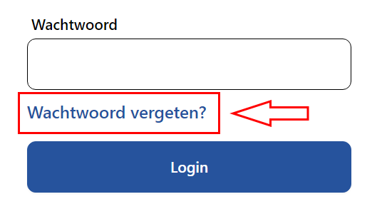
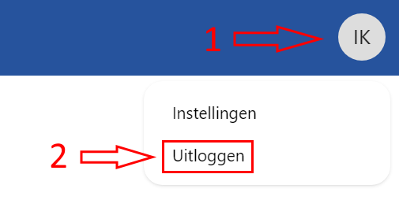

# Registreren, inloggen en uitloggen

U betreedt de applicatie via **vereniging.aidcone.nl**, bijvoorbeeld roosendaal.aidcone.nl. Hier vindt u het startscherm:

Wanneer u voor de eerste keer AidCone opent moet u zich registreren. Dit hoeft maar één keer.

## Registreren

Klik op **Registreren**. Hier wordt u gevraagd om uw toegangscode. Deze krijgt u van uw vereniging.

Voer uw toegangscode in en klik op **Volgende stap**. Hier wordt gevraagd om uw accountgegevens, persoonsgegevens en adresgegevens. Vul deze naar waarheid in om de ledenadministratie van uw vereniging correct te houden.

Het wachtwoord moet 2x worden ingevuld om te voorkomen dat u typfouten maakt.

Bij geboortedatum kunt u de datum intypen of een selectiemenu openen met het kalendericoontje.

Wanneer u alle gegevens heeft ingevuld, klikt u op **Registreren**. U ontvangt nu een e-mailbericht met een zwart blok met daarin de tekst **Verifieër uw e-mailadres**. Klik hierop om uw e-mailadres te verifieëren. U bent nu bij AidCone geregistreerd en kunt gebruik maken van de digitale omgeving van uw EHBO vereniging.

## Inloggen

Wanneer u al een account heeft geregistreerd, kunt u inloggen. Om in te loggen klikt u in het startscherm op **Inloggen**. Voer het e-mailadres en wachtwoord dat u bij de registratie heeft opgegeven in. Hierna wordt u automatisch doorgestuurd naar de applicatie.

## Wachtwoord vergeten

Bent u uw wachtwoord vergeten? Op de pagina Inloggen vindt u een link **Wachtwoord vergeten?**. Klik hierop.

Hier wordt gevraagd om uw e-mailadres. Voer hier het e-mailadres in dat u bij de registratie opgegeven heeft.

U ontvangt nu een e-mailbericht met een zwart blok met daarin de tekst **Wachtwoord resetten**. Klik hierop en voer in het geopende venster een nieuw wachtwoord in. U kunt nu met het nieuwe wachtwoord inloggen.

## Uitloggen

Vooral wanneer u gebruik maakt van een openbare of gedeelde computer is het belangrijk dat u zich na gebruik van applicatie weer uitlogt.

Klik hiervoor op uw initialen rechtsboven in het scherm. Er opent zich een menu, kies daar **Uitloggen**.

Hierna wordt u automatisch doorgestuurd naar het startscherm.